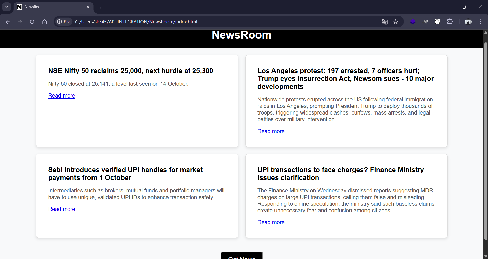

# API-INTEGRATION

*COMPANY*: CODTECH IT SOLUTIONS

*NAME*: Sandeep

*INTERN ID*: CT08DK915

*DOMAIN*: FULL STACK WEB DEVELOPMENT

*BATCH DURATION*: April 25th, 2025 to June 25th, 2025

*MENTOR NAME* : NEELA SANTHOSH KUMAR

# DESCRIPTION OF TASK PERFORMED : 
API integration is a vital aspect of modern web development, enabling applications to communicate and retrieve data from external services. In this project, we utilized the GNews API to fetch and display news articles dynamically, specifically targeting four random news items in English from India. The integration process involved using JavaScript to send HTTP requests to the API's endpoints, retrieve the data, and update the webpage dynamically. A key feature of the design was the "Get News" button, which allowed users to refresh the displayed news articles and ensured that the refreshed content was non-repetitive. To achieve this, logic was implemented to filter out previously displayed articles and maintain a fresh and engaging user experience. The webpage was styled using CSS, focusing on a simple and intuitive design. The news articles were presented in a grid layout using CSS Grid, providing a clean and organized structure that adapted well to various screen sizes. Each article was displayed as a card with a title, a brief description, and a link to the full news article. The card design featured a light background, subtle shadows, and rounded corners to create a professional and visually appealing look.
Integrating APIs into web development is something I find both fascinating and essential for creating dynamic applications. For this project, I used the GNews API to fetch and display news articles in English from India. My goal was to display four random news articles at a time, with a button labeled "Get News" that allows users to refresh the news dynamically. One of the key challenges I addressed was ensuring that the refreshed news articles were not repeated. To achieve this, I implemented logic to filter out already displayed articles, providing users with fresh content every time they clicked the button. I focused on creating a simple and intuitive design for the webpage. Using CSS, I designed a clean layout with a responsive grid system that organized the news articles neatly. Each article was styled as a card, including a title, a brief description, and a link to the full article. I kept the design minimal, with subtle shadows, rounded corners, and a light background to ensure the content remained the focal point. The "Get News" button was an important element of the interface, and I styled it with a modern look—using a black background with white text and adding hover effects for interactivity. I also included smooth transitions to enhance the user experience. 
JavaScript was the backbone of the functionality, allowing me to fetch the news data dynamically from the GNews API, process it, and update the content on the webpage without reloading. By combining JavaScript and CSS effectively, I was able to create a seamless experience where functionality and design worked together. This project showcased how powerful API integration can be in building interactive applications. It was exciting for me to see how a combination of technologies—JavaScript for fetching and rendering data, CSS for styling, and the GNews API for providing real-time content—could come together to deliver a user-friendly and visually appealing solution. Working on this project gave me a deeper appreciation for the importance of thoughtful design and efficient coding practices in creating applications that not only work well but are also enjoyable for users to interact with.

# OUTPUT OF THE TASK

<<<<<<< HEAD

>>>>>>> ec7c4dd9d0e9f13b0a2cddf8ed68b6376e699ae8
